# Creating a Project

### Create a Project while another project is open

### Create a Project with no project open
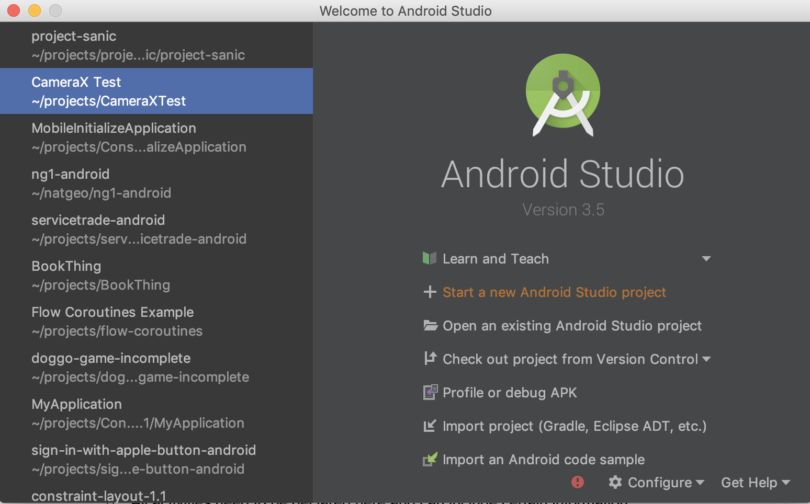

### Create Project - First Screen (Create an Activity)
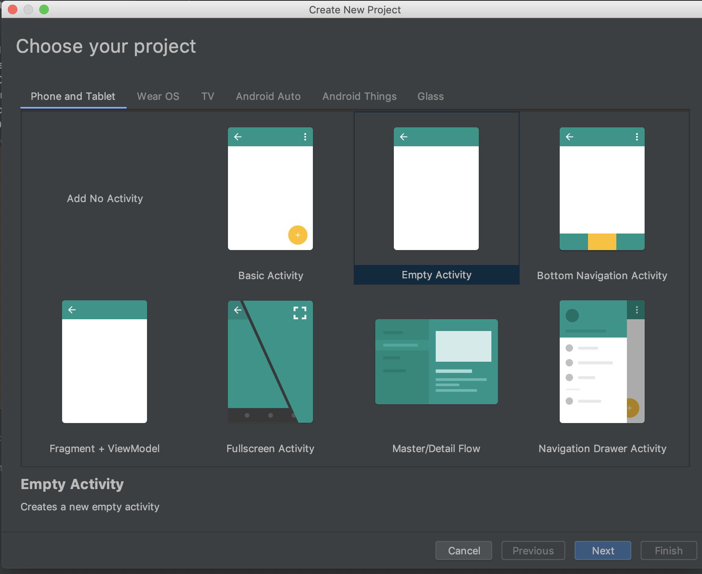

### Create Project - Configuration
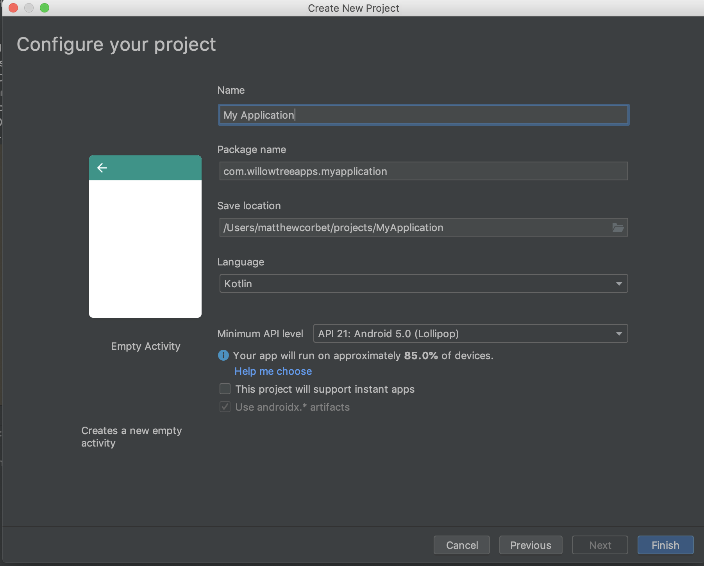

**Name** - The name of your application; this is what appears by default with your app's icon

**Package Name** - A unique identifier for your project

**Save location** - Where you want to save the project locally

**Language** - What language you're writing in (Java for now)

**Minimum API Level** - What you want to target as the lowest version you'll support (leave as 21 for now)

Make sure the box for Instant Apps is **unchecked**

Make sure the `Use androidx.* artifacts` box is checked

# Project Viewing

### Project View

There are two primary ways we can view our app - the Project view and Android view.  Project view is a more literal representation of directories and files while the Android view is a grouping of things like resources (the difference shows when you have different resources e.x. text for the US version and text for the French version).  For now we'll work in the Android view.

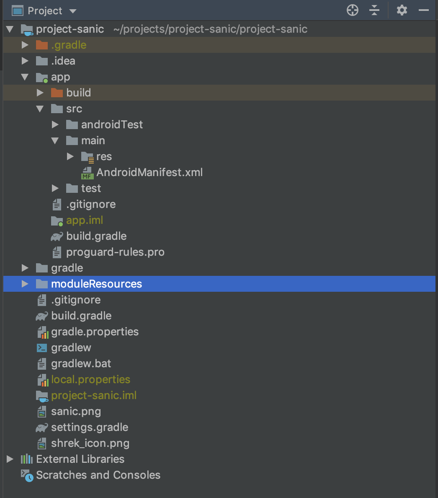

### Android View

# Android Manifest

# Activities

### Creating a new Activity

Create a new Activity using the Wizard by selecting **New** > **Activity** and then choosing from a list of preconfigured Activities (usually **Empty Activity** for me)

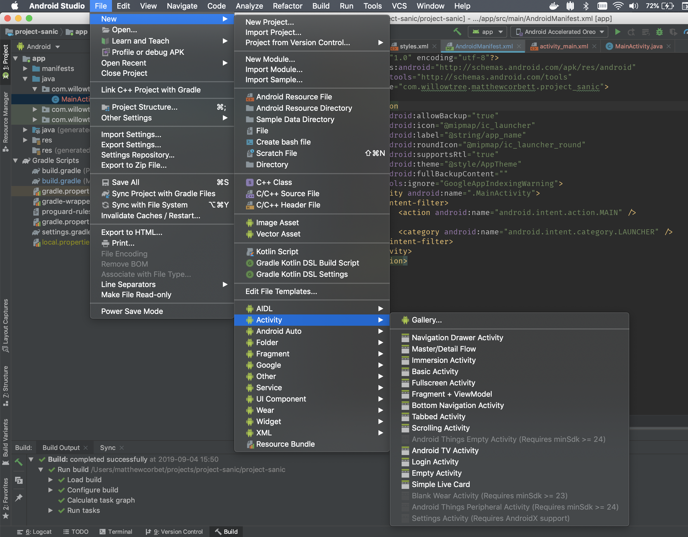

### Configuring our Activity

Configure our Activity by giving it a name.  Usually we won't need to mess with **Package name** or **Source language**.  If we check the box for `Generate Layout File`, then a corresponding XML file is created. If we check the box for `Launcher Activity`, then some filters are added to our `AndroidManifest.xml` file.

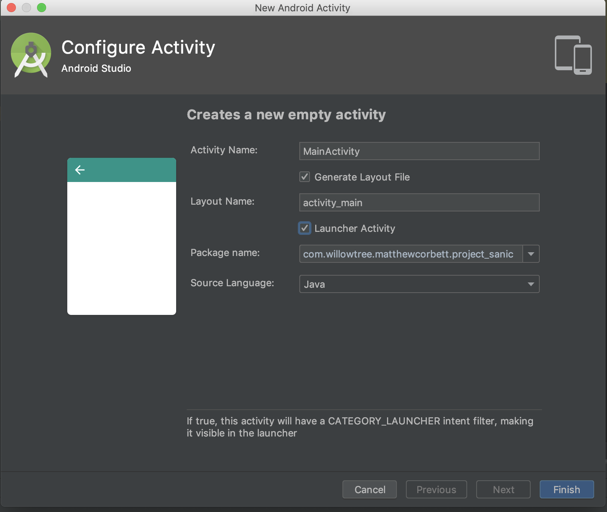

### Activity Lifecycle

You’ll hear the word lifecycle **a lot** in Android development - the lifecycle is basically a set of hooks into large actions of the app.  There are 6 main methods to know:

`onCreate`

`onStart`

`onResume`

`onPause`

`onStop`

`onDestroy`

You can think of `onCreate` as when the activity is first created but isn’t visible, `onStart` when the activity first becomes visible, and `onResume` when the user can interact with the app.  The opposite is basically true for the other methods, with `onPause` being the opposite of `onResume` (the activity is no longer in the foreground), `onStop` being the opposite of `onStart`, and `onDestroy` being the opposite of `onCreate`.

We’ll normally link our layouts with our views (get references to all our text boxes, buttons, etc) in `onCreate`, link/unlink running services in `onResume`/`onPause`.

# Resources

### The `res` folder

While we use Java (or, preferably, Kotlin) for writing the logic and views classes in our app, all of our resources are handled via XML.  If you’re not familiar with XML, it’s basically just a series of tags with attributes defined inside those tags, and Android Studio’s autocomplete makes it easy to fill in these attributes. 

These resources files are all sorted under the res folder and grouped by their type. We’ll look at five major types: strings, dimensions/dimens, colors, drawables (basically images), and layouts. There are a few reasons we have all these files for resources rather than just putting them in the code, but the most important is probably reuse - if we define a string in one place and reference it in 10 places, then if we need to update it we only need to update it in one place and the change shows in all 10 places it’s referenced.

### `strings.xml` - keeper of the text

Strings can be found by default in strings.xml in the values folder.  This file is usually autogenerated for us when we start a new project.  The way we add a string is to open a string tag, provide the name attribute (basically a variable name for that string), and put the string itself between the string tags.

We can see the definition of `sample_text` here, and its use via `@string/sample_text` in the layout file

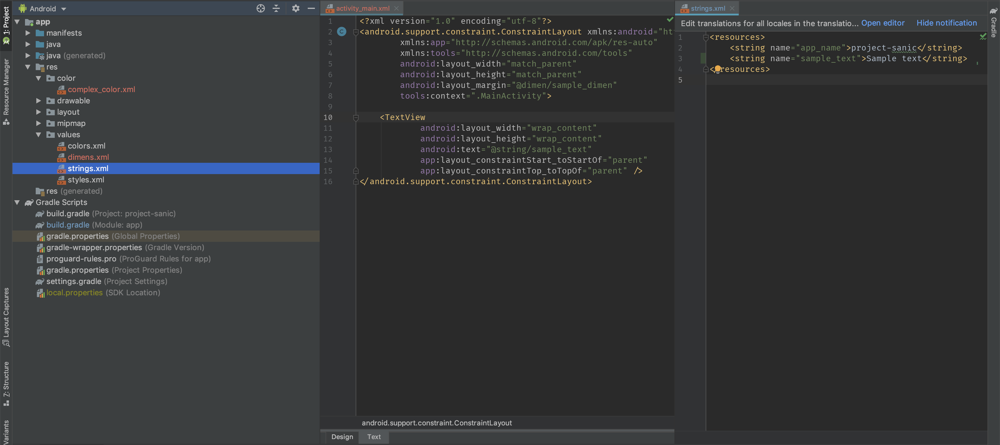

### `dimens.xml` - all our measurements

Dimensions are the measurements of our app - how big do we want the text size to be, how big do we want the button to be, etc - and can be measured in a few different ways.  While you can specify pixels with *px*, it’s rarely done and you should avoid it.  Instead, for measurements like margins or padding, you’ll use something called *dp* or device-independent pixels.  You can declare these dimensions and they should translate to about the same relative space regardless of how large or dense a device is.  For text-related fields (mainly text size), we’ll use something called *sp*, or scalable pixels.

We can see a sample definition here, with `sample_dimen` defined in `dimens.xml` and its usage in the layout file

### `colors.xml` - all our colors and color states

Colors are a little weirder, but most of your colors will also be found in the values folder in colors.xml. The declaration syntax looks a lot like strings, except we use the word color.  Colors are declared using RGB (Red Green Blue) or ARGB (Alpha/transparency Red Green Blue), prefaced by a hashtag. If you omit the transparency it’s assumed to be completely opaque.  There’s also a color folder that we’ll ignore for now - it’s primarily for more complex scenarios (where you might want a button to have a different background or different transparency depending on whether you’re enabling or disabling clicks).

#### The `colors.xml` file and how we define colors

#### The `colors` folder and an example of a complex color. In this example, the color is `colorPrimary` if the item is selected, and `colorPrimaryDark` in any other case.

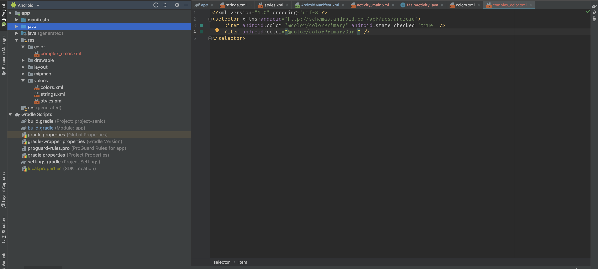

### `drawables` - pretty pictures

Drawables are basically just images we want to use in our app - commonly in the format of JPG, PNG, or something called an SVG.  We can also have multiple drawables for what we call screen densities, so maybe the same image but each at higher and higher density/resolution.

Here we have an example of how we dropped a PNG into our drawable folder. Drawables are referenced with `@drawable/<name>`, so `sanic.png` becomes `@drawable/sanic`

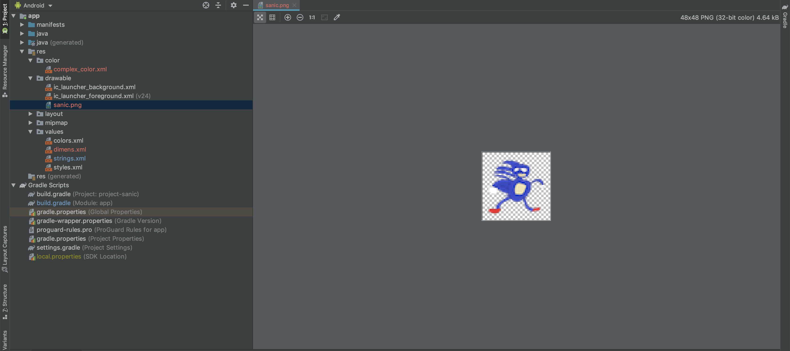

### `layout` files - what our screens look like

Layout files are a bit more complicated - these are how we build out what a screen looks like.  The first element in these layout files is something called a ViewGroup - a view that can hold other views (like buttons, text boxes, etc) inside it.

Two attributes that are common (and required) for every view are `layout_width` and `layout_height`. These can take a hardcoded value/dimension (e.x. 150dp), but more often you’ll use some presets.  `match_parent` will look at the parent view, look at its height/width, and make the view as big as that, while `wrap_content` will measure how much space the view needs (like how much space a text field’s text needs to fully display) and make the view that big (or as big as the parent if it needs more space than the parent has).

Another incredibly important attribute (although technically not required) is `android:id`. The ID is what lets us easily connect that particular view from our layout file to our activity. It can also help if we need to reference that view again in the layout file (which we’ll talk about in some of our ViewGroups). To see how some of this works, let’s look at 3 of the most common ViewGroups.

We have two different ways to create our layouts - Design view and Text view.  The Text view is just that - a text (XML) representation of our layout, while the Design view shows us a render of the screen and allows for drag-and-drop of our Views.

#### Design view
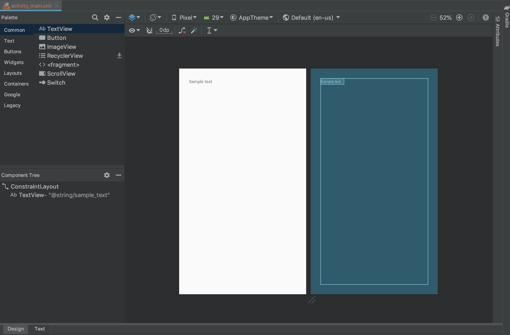

#### Text view

### Common Layouts

Here we'll look at three common layout types: `LinearLayout`, `RelativeLayout`, and `ConstraintLayout`.  We'll look at a very simple screen, with one text box reading "Sample Text" above another box reading "More text".

#### LinearLayout

Like the name suggests, LinearLayout lays things out linearly using the same order as they’re declared in the XML.  The main attribute you need to set here is `android:orientation` and give it a value of either `vertical` or `horizontal`.

All we did here was specify `android:orientation="vertical"` and then declare the text boxes in the order we want them

#### RelativeLayout

You can use RelativeLayout to position something *relative* to something else.  Maybe you want a view to be centered horizontally, in which case you add the attribute `android:layout_centerHorizontal=”true”` or maybe you want to position view2 below view1, you would add the attribute `layout_below=”@id/view1”` to view2.  There are a ton of attributes for RelativeLayout which you can find in the documentation.

To get our desired layout here, we specified `android:layout_below="@id/first_text_box"` to place the second text box below the first

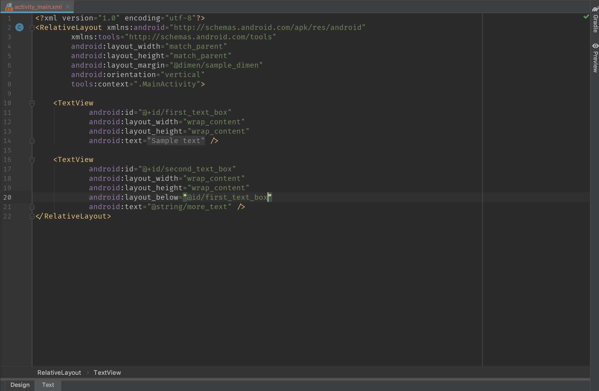

#### ConstraintLayout

ConstraintLayout works by allowing you to position and size views relative to other views (including the parent). Using ConstraintLayout also adds a new potential value for `layout_width` and `layout_height` - 0dp.  Usually setting something to 0dp would make it take up no space, but in ConstraintLayout it translates to something called `MATCH_CONSTRAINTS`, where the view will size itself according to how it is constrained. 

To accomplish our layout here, we have to *constrain* each text box.  We want the first text box in the upper left, so we specify these attributes:
`app:layout_constraintStart_toStartOf="parent"` to put the beginning of this view at the beginning of the screen
`app:layout_constraintTop_toTopOf="parent"` to put the top of this view at the top of the screen

For the second text box, we specify these values:
`app:layout_constraintStart_toStartOf="@id/first_text_box"` to put the start of this text box aligned with the start of the first text box
`app:layout_constraintTop_toBottomOf="@id/first_text_box"` to put the top of the second text box right below the bottom of the first text box

### Gradle

Gradle is Android’s build system - it’s where you’ll declare your minimum, target and compile SDKs, specify libraries that you’re using and can configure a whole lot of other stuff for your build.  We won’t need to dive super far into Gradle yet, but just know that this block here (the dependencies block) is used to manage all your imported libraries and that this is where you’d put any new libraries you want to use.

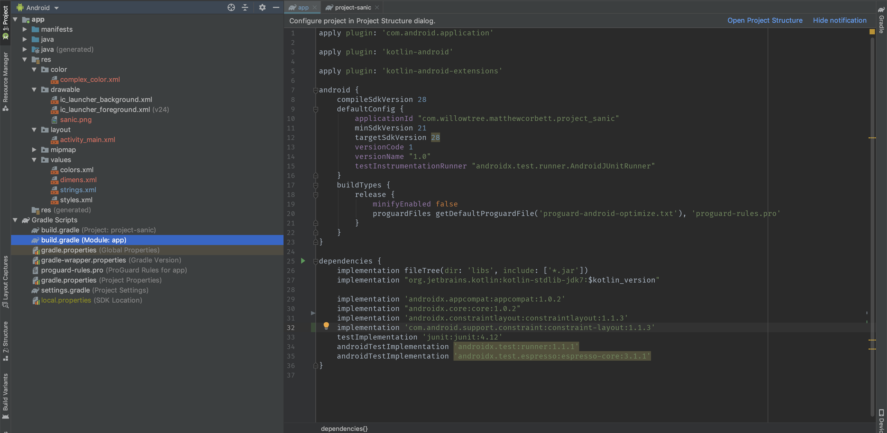

### Debugging / Breakpoints

#### Setting a breakpoint

To insert a breakpoint, we’ll click in the gutter (the blank space between the line number and the code on that line) over here on the line number we want to stop execution at. Here we're setting a breakpoint at `setContentView`

#### Starting with a debugger attached

We need to run our app on some device (real or emulator) and make sure it has a debugger attached.  We can do that by either attaching a debugger from the start (shown in the image below) or by attaching a debugger when the app is running (Attach Debugger to Android Process which is 3 buttons over from our Start with Debugger button).

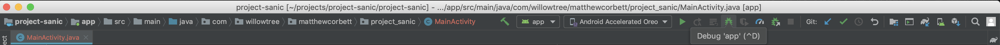

#### Hitting a breakpoint

When we hit this breakpoint, we can see the method call stack over here on the far left - this can be useful for tracking down where your call was initially made so you can check things along the way.  We can also see our variables and their current values just to the right of that.

You’ll notice a lot of arrow icons just above these windows - these can be used to incrementally go through your breakpoint, stepping over certain steps, into others, or out of others.  We can also click this little calculator (right above the Variables window in the screenshot) that will allow us to evaluate expressions based off of the state where our breakpoint is.

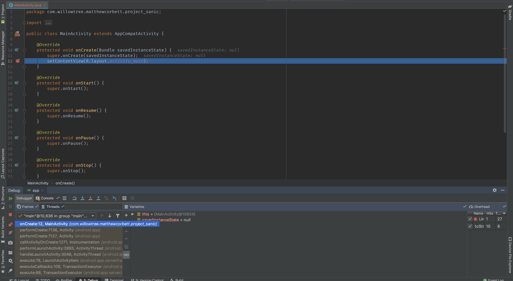