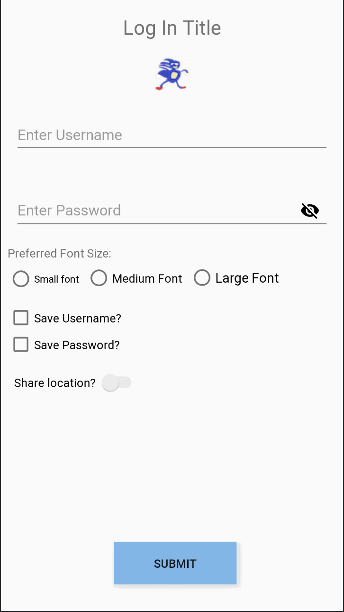

For this task, we'll build out a login screen.  This screen will make use of many different kinds of views.

You can build out this screen any way you like - RelativeLayout, ConstraintLayout, or (don't really recommend this) LinearLayout - but maintain the general structure.

The screen consists of:
- A title (make it whatever you want - Log In Title here)
- An image (feel free to choose whichever image you like - pngs are easiest)
- Two text entry fields (Username and Password)
- A group to select what font size you want
- Boxes to select whether you want to save your username and/or password
- A toggle to allow sharing your location
- A button to submit your info

You can implement this however you want! Things don't have to line up perfectly (though you should try to make them look good) and experiment with the colors and sizes. You should try to make this screen as close as possible (think things like positioning and using the same widgets) but you're also free to experiment.

There are a few guidelines for making the layout:
1. Strings should be referenced using string resources - `@string/hello_world` rather than hard-coding `Hello World`.
2. Dimensions should be referenced using dimens resources - `@dimen/small_font_size` rather than hardcoding a `sp` value
3. The username text entry should be plaintext
4. The password text entry should have dots instead of showing the password in plaintext, UNLESS the user clicks the password eye icon (toggling between dots and plaintext)
5. The user should only be able to select one of `Small Font`, `Medium Font`, and `Large Font`

Additionally, there are some criteria that will involve you wiring this up in code:
1. Usernames should only be up to 16 characters long. Validate this as the user types and show an error if they go over.
2. Passwords should be at least 8 characters long. Validate this as the user types and show an error if they try to submit with an invalid password.
3. When the user hits the Submit button, use a [Toast](https://developer.android.com/guide/topics/ui/notifiers/toasts#java) or [Log](https://developer.android.com/reference/android/util/Log) to print out the username, password, which font size was chosen, and whether the user chose to save their password, save their username, and share their location.